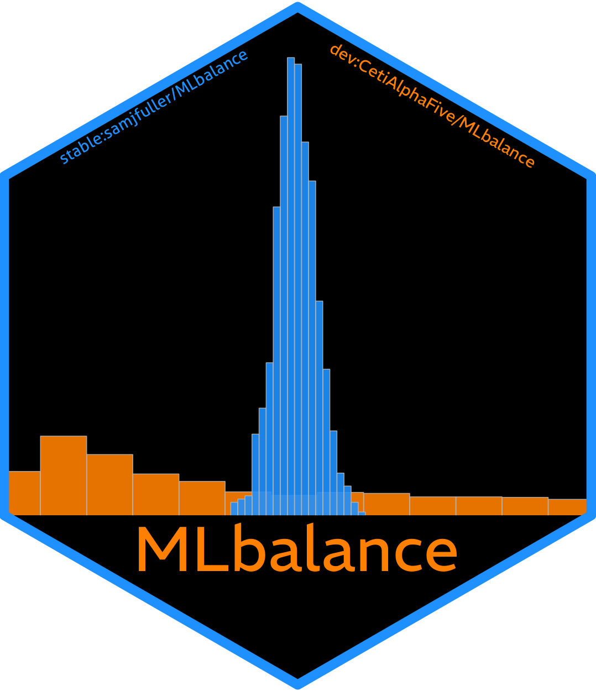

{.headshot}

Hello there! I'm a political scientist and postdoctoral fellow at the Ronald Reagan Presidential Foundation and Institute in Washington D.C.

My substantive research employs causally oriented machine learning methods to study American political institutions, political behavior, and public policy. I work on oversight and policymaking in I dub the "Legislative State," a network of understudied people and institutions that support the Congress.

Methodologically I develop and apply new methods, as well as software tools, for difficult social science problems. To that end, I teach a graduate-level topical workshop on [causal machine learning](https://samjfuller.com/content/ICPSR_Causal_Machine_Learning_Syllabus_2025.pdf) methods at the Inter-university Consortium for Political & Social Research (ICPSR) at the University of Michigan.

I hold a Ph.D. in [Political Science](https://ps.ucdavis.edu/) at the [University of California, Davis](https://www.ucdavis.edu/) with subfields in methods and American politics. I also received a B.A. in Economics and Political Science from George Washington University.

Before graduate school, I was an economic policy research analyst at the [Bipartisan Policy Center](https://bipartisanpolicy.org/). At BPC, I contributed to research on the [federal budget](https://bipartisanpolicy.org/wp-content/uploads/2019/09/PGPF-Bipartisan-Policy-Center-Solutions-Initiative-2019-Report.pdf), [debt limit](https://bipartisanpolicy.org/download/?file=/wp-content/uploads/2019/03/Debt-Limit-Analysis-Everything-You-Need-to-Know-March-2019.pdf), [Social Security and Medicare financing](https://bipartisanpolicy.org/download/?file=/wp-content/uploads/2019/03/A-Guide-to-the-2018-Social-Security-and-Medicare-Trustees-Reports.pdf), and [defense personnel reform](https://www.heritage.org/sites/default/files/2018-09/2019_IndexOfUSMilitaryStrength_CHAPTERS_MISZTAL-RAMETTA.pdf).

::: hex-stickers
   
:::
