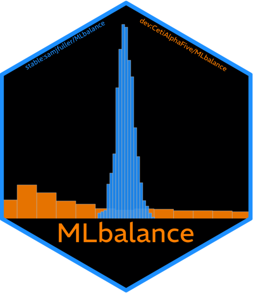

::: pkg-entry

[**UtopiaPlanitia:**](https://github.com/CetiAlphaFive/UtopiaPlanitia) An expansive package that provides a suite functions associated with causal machine learning. This includes: causal variable importance implementations (e.g. leave-one-covariate-out (LOCO) variable importance), an omnibus suite of treatment effect heterogeneity tests, implementations of alternative curve-fitting algorithms for popular causal machine learning methods, partial dependence plots, and S3 summary/plot methods for causal forest objects from the `grf` package.
:::

::: pkg-entry

[**gao:**](https://github.com/CetiAlphaFive/gao) A package that scrapes all publicly available Government Accountability Office published materials and returns both the original PDF/.html files as well as a cleaned dataset that extracts information from the pages. Updated daily. Associated working paper is Rametta (2026).
:::

::: pkg-entry
**ocx:** Extended optimal classification (ocx) is an R package for nonparametric spatial-model scaling of binary and ordinal choice data via Optimal Classification (with Christopher D. Hare, Tzu-Ping Liu, and Keith T. Poole). It unifies and extends the previous `oc` and `ooc` packages in a fully compiled, threaded C++ engine with numerous added features.
:::

::: pkg-entry

[**MLbalance:**](https://github.com/CetiAlphaFive/MLbalance) Implements a suite of machine learning balance tests for experimental and observational data. These tests are designed to detect failures of random assignment or covariate imbalance using machine learning and permutation inference. Associated working paper is Rametta and Fuller (2026).
:::

::: pkg-entry
[**2026 Senate Forecast:**](/senate-forecast/) A live, Bayesian forecast of the 2026 U.S. Senate elections (with Christopher D. Hare). Companion working paper: Rametta and Hare (2026).
:::

::: pkg-entry

[**roadrunner:**](https://github.com/CetiAlphaFive/roadrunner) Fast, low-dependency implementations of classical machine learning algorithms with C++ backends via `Rcpp` and `RcppParallel`. Includes multivariate adaptive regression splines, kernel regularized least squares, penalized linear discriminant analysis, and component-wise P-spline gradient boosting, plus `meep()`, a cross-fitted stacked ensemble built for double machine learning and causal-forest nuisance estimation.
:::
